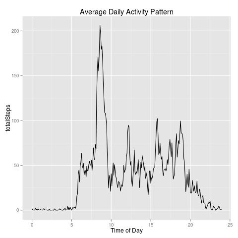
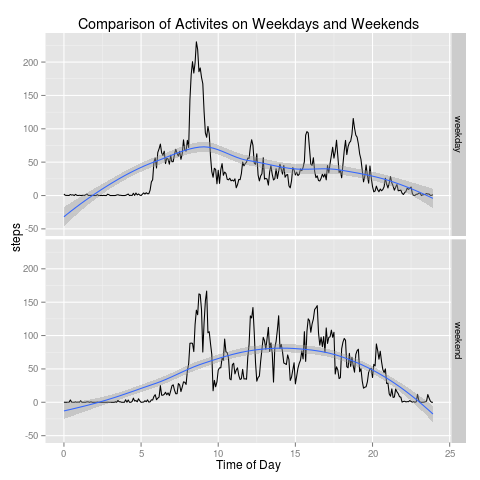

## Loading and preprocessing the data 
###### Definition of common functions
```{r commonFunctions tidy:TRUE}
library(plyr)
library(ggplot2)
mean.calculation <- function (a){
    meanPerInterval <- aggregate(x = a$steps, by = list(factor(a$interval)), FUN = "mean")
    # add column names
    colnames(meanPerInterval) <- c("interval","totalSteps")
    # convert interval to a numeric and split into hours and minutes
    meanPerInterval$interval <- as.numeric(as.character(meanPerInterval$interval))
    rownames(meanPerInterval) <- meanPerInterval$interval
    h <- as.integer(meanPerInterval$interval/100)
    m <- meanPerInterval$interval - h*100
    # calculate interval as fractional hours (needed to make plots uniform in time)
    fInterval <- h+m/60
    meanPerInterval <- cbind(meanPerInterval,fInterval)
    return (meanPerInterval)
}
```
###### Read raw data
```{r loadRawData tidy:TRUE}

unzip("activity.zip")
activity <- read.csv("activity.csv")
```
###### Create data frame with NA removed
```{r removeNA tidy:TRUE}
ac <- activity[!is.na(activity$steps),]
```

## What is mean total number of steps taken per day?
###### Create aggregate data frame with monthly totals
```{r mean tidy:TRUE}
totalPerDay <- aggregate(x = ac$steps, by = list(factor(ac$date)), FUN = "sum")
colnames(totalPerDay) <- c("Date","TotalSteps")
```
###### Total number of steps taken per day

```{r viewtotal}
totalPerDay
```

```{r plotHistogram tidy:TRUE}

png(file="figures/histogram.png",width=480,height=480)
phist <- ggplot(totalPerDay, aes(x=TotalSteps)) + geom_histogram(binwidth=1000)
phist+xlab("Steps")+ggtitle("Histogram of Total Steps Per Day")
invisible(dev.off())

```

```{r meanmedian tidy:TRUE}
meanSteps <- sprintf("%0.f",mean(totalPerDay$TotalSteps))
medianSteps <- sprintf("%0.f",median(totalPerDay$TotalSteps))

```

###### Mean of number of steps per day : `r meanSteps`
###### Median of number of steps per day : `r medianSteps`

## What is the average daily activity pattern?
#### The average number of steps taken in 5-minute intervals, averaged across all days 
```{r meanPerInterval tidy:TRUE}
meanPerInterval <- mean.calculation(ac)
```
```{r plotAverage tidy:TRUE}
png(file="figures/average.png",width=480,height=480)
ggplot(meanPerInterval, aes(x=fInterval, y=totalSteps)) + geom_line()
# plot(meanPerInterval$fInterval,meanPerInterval$totalSteps,type='n',xlab="Time of Day",ylab="Average number of steps")
# lines(meanPerInterval$fInterval,meanPerInterval$totalSteps)
invisible(dev.off())
```


#### Locate the maximum number of average steps and the interval in which it occurs
```{r maxSteps tidy:TRUE}
maxAverageSteps <- max(meanPerInterval$totalSteps)
maxStepsAt <- subset(meanPerInterval,subset=(meanPerInterval$totalSteps==maxAverageSteps))$interval

```
###### Max average number of steps: `r maxAverageSteps`
###### Interval in which it occur: `r maxStepsAt` 


## Imputing missing values

```{r missingData tidy:TRUE}
naindex <- which(is.na(activity)==TRUE)
nNa <- length(naindex)
```
###### The total number of missing values in the dataset: `r nNa`


#### Create data frame with imputed missing values
###### Imputing strategy
Replace NA with the mean value of the corresponding 5 minute slot
```{r fillMissingData tidy:TRUE}
# Copied from post: https://class.coursera.org/repdata-004/forum/thread?thread_id=82
# Thank You, Greg Tyler
# Function to replace NA by value from a data frame
# technique to replace NA with mean by subset in R and the impute.mean function 
# described at http://stackoverflow.com/a/9322975/3657371

# create a new dataset that is equal to the original dataset, but with the 
# missing data filled in

impute.mean <- function(x) replace(x, is.na(x), mean(x, na.rm = TRUE))
activity.imputed <- plyr::ddply(activity[1:3], .(interval), transform,
                                steps = impute.mean(steps),
                                date = date,
                                interval = interval)
# sort by date and interval
activity.imputed <- activity.imputed[order(activity.imputed$date,
                                           activity.imputed$interval),]
```
```{r printImputedData}
head(activity.imputed)
```

## What is mean total number of steps taken per day?
```{r meanImputed tidy:TRUE}
ai <- activity.imputed
totalPerDayi <- aggregate(x = ai$steps, by = list(factor(ai$date)), FUN = "sum")
colnames(totalPerDayi) <- c("Date","TotalSteps")
```
#### Total number of steps taken per day

```{r viewtotali}
totalPerDayi
```

```{r plotHistogrami tidy:TRUE}

png(file="figures/histogrami.png",width=480,height=480)
#hist(totalPerDayi$TotalSteps,main ="Histogram of Total Steps Per Day", xlab="Steps",breaks=10)
phist <- ggplot(totalPerDayi, aes(x=TotalSteps)) + geom_histogram(binwidth=1000)
phist+xlab("Steps")+ggtitle("Histogram of Total Steps Per Day")
invisible(dev.off())

```

```{r meanmediani tidy:TRUE}
meanStepsi <- sprintf("%0.f",mean(totalPerDayi$TotalSteps))
medianStepsi <- sprintf("%0.f",median(totalPerDayi$TotalSteps))

```

###### Mean of number of steps per day : `r meanStepsi`
###### Median of number of steps per day : `r medianStepsi`
#### ANALYSIS 
No significant difference between data with NA removed and data with imputed values in place of NA 


## Are there differences in activity patterns between weekdays and weekends?
```{r weekendsVsWeekdays tidy:TRUE}
wd <- factor(as.POSIXlt(ai$date)$wday %in% c(0,6),labels=c("weekday","weekend"))
ai1<-cbind(ai,dayType = wd)
a.weekend <- subset(ai1,subset=ai1$dayType=="weekend")
a.weekday <- subset(ai1,subset=ai1$dayType=="weekday")
meanPerInterval.weekend <- mean.calculation(a.weekend)
meanPerInterval.weekday <- mean.calculation(a.weekday)
meanPerInterval.weekend <- cbind(meanPerInterval.weekend,c("weekend"))
meanPerInterval.weekday <- cbind(meanPerInterval.weekday,c("weekday"))
colnames(meanPerInterval.weekend)<-c("interval","steps","fInterval","dayType")
colnames(meanPerInterval.weekday)<-c("interval","steps","fInterval","dayType")
meanPerInterval.both <- rbind(meanPerInterval.weekday,meanPerInterval.weekend)
png(file="figures/week.days.end.png",width=480,height=480)
p<-ggplot(meanPerInterval.both, aes(x=fInterval, y=steps)) + geom_line()+geom_smooth(method=loess)+ggtitle("Comparison of Activites on Weekdays and Weekends")
p+facet_grid(dayType~.)

invisible(dev.off())	
```
  

#### ANALYSIS
The comparison between activity on weekdays versus on weekends is shown in the graphs above along with the smoothed curves, It is clear that on weekdays the activity is most in the early hours (before 10:00 am) where as on weekends it is more distributed through out the day.


